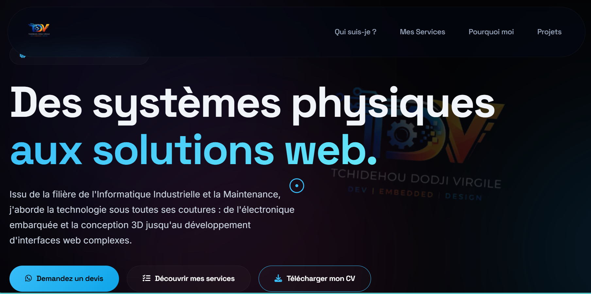

# 🚀 TDV Tech

Welcome to **TDV Tech**, my personal portfolio showcasing my work, skills and projects.

## 👨‍💻 About Me

I am **Tchidehou Dodji Virgile**, a developer passionate about building complete and impactful solutions.

My work combines:
- 💻 Web Development (Frontend & Backend)
- ⚙️ Embedded Systems
- 🎨 Design & Visual Identity

I focus on creating projects that are both **functional, efficient and visually appealing**.

---

## 🛠️ Technologies

- HTML5 / CSS3 / JavaScript
- Backend development
- Arduino & Microcontrollers (ATmega)
- Proteus (Simulation)
- Git & GitHub

---

## 📂 Features of this Portfolio

- Modern and responsive design
- Presentation of my projects
- Description of my services
- Contact section

---

## 🚀 Live Demo

👉 [Visitez le site en direct : tdv-tech.vercel.app](https://tdv-tech.vercel.app/)

---

## 📸 Preview

---

## 📬 Contact

If you want to work with me or have a project:

- 🔗 GitHub: https://github.com/Badmus2005  
- 🔗 Facebook: https://www.facebook.com/atchamou05  
- 🔗 Instagram: https://www.instagram.com/dodji_atchamou/
- 💼 LinkedIn: https://www.linkedin.com/in/dodji-virgile-tchidehou-b1612b347/ 
- 💬 WhatsApp: https://wa.me/2290156043081  
- 📧 Email: tchidehoudojivirgile@gmail.com  
- 📞 Phone: +2290156043081  

---

## 🔥 Vision

My goal is to design and develop **innovative technological solutions** combining software, hardware and creativity.

---

## ⭐️ Support

If you like this project, feel free to **star the repository** ⭐

---

## © TDV Tech
